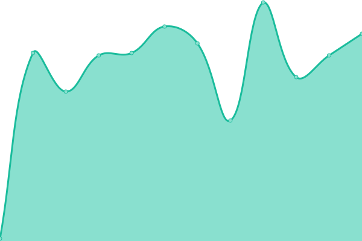
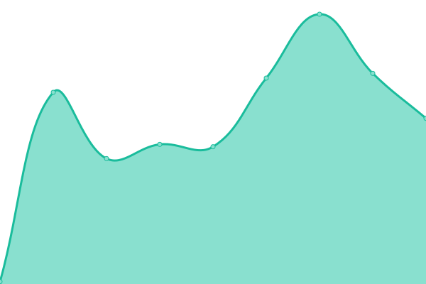
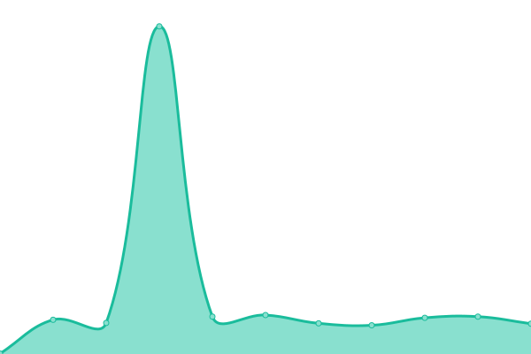
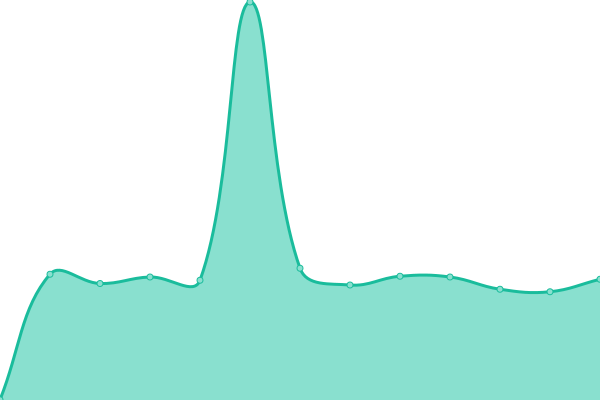
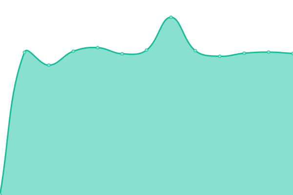
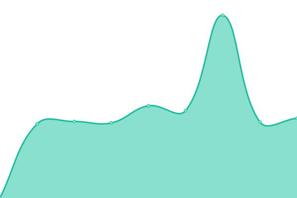
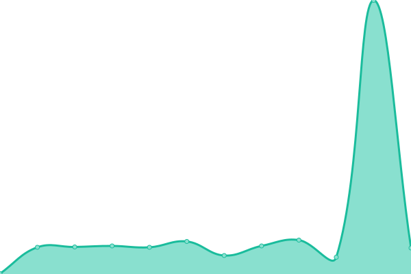

# 📈 Live Status: <!--live status--> **🟧 Partial outage**

<!--start: status pages-->
<!-- This summary is generated by Upptime (https://github.com/upptime/upptime) -->
<!-- Do not edit this manually, your changes will be overwritten -->
<!-- prettier-ignore -->
| URL | Status | History | Response Time | Uptime |
| --- | ------ | ------- | ------------- | ------ |
|  [bit01](https://www.bit01.de) | 🟩 Up | [bit01.yml](https://github.com/bitnulleins/monitoring/commits/HEAD/history/bit01.yml) | 

 1307ms
     
 | 

<a href="https://bitnulleins.github.io/monitoring/history/bit01">100.00%</a>
    

|  [bytethinks](https://www.bytethinks.de) | 🟩 Up | [bytethinks.yml](https://github.com/bitnulleins/monitoring/commits/HEAD/history/bytethinks.yml) | 

 1072ms
     
 | 

<a href="https://bitnulleins.github.io/monitoring/history/bytethinks">100.00%</a>
    

|  [Keikogi Tool](https://keikogi.bitnulleins.de) | 🟩 Up | [keikogi-tool.yml](https://github.com/bitnulleins/monitoring/commits/HEAD/history/keikogi-tool.yml) | 

 693ms
     
 | 

<a href="https://bitnulleins.github.io/monitoring/history/keikogi-tool">100.00%</a>
    

|  [Bricksfinder](https://bricksfinder.bitnulleins.de) | 🟩 Up | [bricksfinder.yml](https://github.com/bitnulleins/monitoring/commits/HEAD/history/bricksfinder.yml) | 

 684ms
     
 | 

<a href="https://bitnulleins.github.io/monitoring/history/bricksfinder">100.00%</a>
    

|  Handwerker | 🟩 Up | [handwerker.yml](https://github.com/bitnulleins/monitoring/commits/HEAD/history/handwerker.yml) | 

 1475ms
     
 | 

<a href="https://bitnulleins.github.io/monitoring/history/handwerker">100.00%</a>
    

|  Spielgruppe | 🟩 Up | [spielgruppe.yml](https://github.com/bitnulleins/monitoring/commits/HEAD/history/spielgruppe.yml) | 

 1163ms
     
 | 

<a href="https://bitnulleins.github.io/monitoring/history/spielgruppe">100.00%</a>
    

|  Natur Blog | 🟩 Up | [natur-blog.yml](https://github.com/bitnulleins/monitoring/commits/HEAD/history/natur-blog.yml) | 

 1566ms
     
 | 

<a href="https://bitnulleins.github.io/monitoring/history/natur-blog">100.00%</a>
    

|  Karate | 🟩 Up | [karate.yml](https://github.com/bitnulleins/monitoring/commits/HEAD/history/karate.yml) | 

 1487ms
     
 | 

<a href="https://bitnulleins.github.io/monitoring/history/karate">100.00%</a>
    

|  Forschungsgruppe | 🟩 Up | [forschungsgruppe.yml](https://github.com/bitnulleins/monitoring/commits/HEAD/history/forschungsgruppe.yml) | 

 1766ms
     
 | 

<a href="https://bitnulleins.github.io/monitoring/history/forschungsgruppe">100.00%</a>
    

|  Auge | 🟩 Up | [auge.yml](https://github.com/bitnulleins/monitoring/commits/HEAD/history/auge.yml) | 

 1132ms
     
 | 

<a href="https://bitnulleins.github.io/monitoring/history/auge">100.00%</a>
    

|  Zahn | 🟩 Up | [zahn.yml](https://github.com/bitnulleins/monitoring/commits/HEAD/history/zahn.yml) | 

 1647ms
     
 | 

<a href="https://bitnulleins.github.io/monitoring/history/zahn">100.00%</a>
    

|  SYNOLOGY | 🟩 Up | [synology.yml](https://github.com/bitnulleins/monitoring/commits/HEAD/history/synology.yml) | 

 2351ms
     
 | 

<a href="https://bitnulleins.github.io/monitoring/history/synology">100.00%</a>
    

|  DNAS | 🟥 Down | [dnas.yml](https://github.com/bitnulleins/monitoring/commits/HEAD/history/dnas.yml) | 

 0ms
     
 | 

<a href="https://bitnulleins.github.io/monitoring/history/dnas">0.01%</a>
    

<!--end: status pages-->

[**Visit status website →**](https://bitnulleins.github.io/monitoring/)
