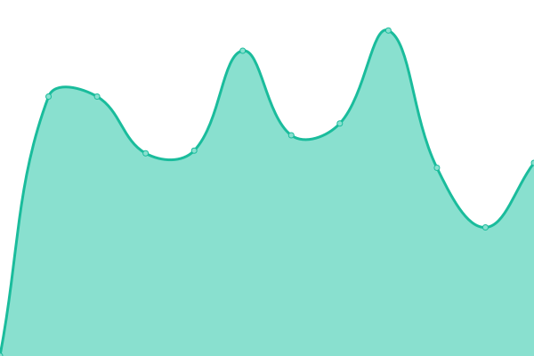
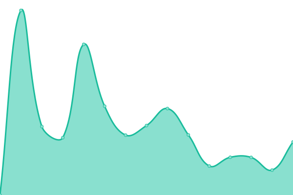
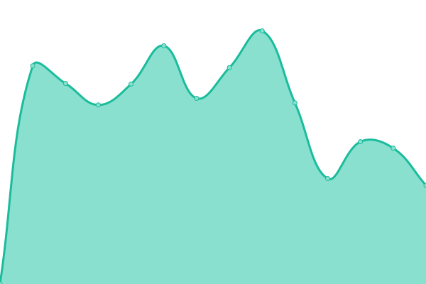

# 📈 Live Status: <!--live status--> **🟩 All systems operational**

<!--start: status pages-->
<!-- This summary is generated by Upptime (https://github.com/upptime/upptime) -->
<!-- Do not edit this manually, your changes will be overwritten -->
<!-- prettier-ignore -->
| URL | Status | History | Response Time | Uptime |
| --- | ------ | ------- | ------------- | ------ |
|  [bit01](https://www.bit01.de) | 🟩 Up | [bit01.yml](https://github.com/bitnulleins/monitoring/commits/HEAD/history/bit01.yml) | 

 1702ms
     
 | 

<a href="https://bitnulleins.github.io/monitoring/history/bit01">100.00%</a>
    

|  [bytethinks](https://www.bytethinks.de) | 🟩 Up | [bytethinks.yml](https://github.com/bitnulleins/monitoring/commits/HEAD/history/bytethinks.yml) | 

 2654ms
     
 | 

<a href="https://bitnulleins.github.io/monitoring/history/bytethinks">100.00%</a>
    

|  [bitnulleins](https://www.bitnulleins.de) | 🟩 Up | [bitnulleins.yml](https://github.com/bitnulleins/monitoring/commits/HEAD/history/bitnulleins.yml) | 

 987ms
     
 | 

<a href="https://bitnulleins.github.io/monitoring/history/bitnulleins">100.00%</a>
    

|  SYNOLOGY | 🟩 Up | [synology.yml](https://github.com/bitnulleins/monitoring/commits/HEAD/history/synology.yml) | 

 2303ms
     
 | 

<a href="https://bitnulleins.github.io/monitoring/history/synology">100.00%</a>
    

|  [Bricksfinder](https://bricksfinder.bit01.de) | 🟩 Up | [bricksfinder.yml](https://github.com/bitnulleins/monitoring/commits/HEAD/history/bricksfinder.yml) | 

 1073ms
     
 | 

<a href="https://bitnulleins.github.io/monitoring/history/bricksfinder">100.00%</a>
    

|  [Dohrn Heizung](https://www.dohrn-heizung.de) | 🟩 Up | [dohrn-heizung.yml](https://github.com/bitnulleins/monitoring/commits/HEAD/history/dohrn-heizung.yml) | 

 3306ms
     
 | 

<a href="https://bitnulleins.github.io/monitoring/history/dohrn-heizung">100.00%</a>
    

|  [Spielgruppe Halstenbek](https://www.spielgruppe-halstenbek.de) | 🟩 Up | [spielgruppe-halstenbek.yml](https://github.com/bitnulleins/monitoring/commits/HEAD/history/spielgruppe-halstenbek.yml) | 

 2637ms
     
 | 

<a href="https://bitnulleins.github.io/monitoring/history/spielgruppe-halstenbek">100.00%</a>
    

|  [Forschungsgruppe](https://datascience.entavis.com) | 🟩 Up | [forschungsgruppe.yml](https://github.com/bitnulleins/monitoring/commits/HEAD/history/forschungsgruppe.yml) | 

 4137ms
     
 | 

<a href="https://bitnulleins.github.io/monitoring/history/forschungsgruppe">100.00%</a>
    

|  [Augenarzt Tornesch](https://www.augenarzt-tornesch.de) | 🟩 Up | [augenarzt-tornesch.yml](https://github.com/bitnulleins/monitoring/commits/HEAD/history/augenarzt-tornesch.yml) | 

 2165ms
     
 | 

<a href="https://bitnulleins.github.io/monitoring/history/augenarzt-tornesch">100.00%</a>
    

|  [Zahnarzt Tornesch](https://www.zahnarzt-richel.de) | 🟩 Up | [zahnarzt-tornesch.yml](https://github.com/bitnulleins/monitoring/commits/HEAD/history/zahnarzt-tornesch.yml) | 

 2551ms
     
 | 

<a href="https://bitnulleins.github.io/monitoring/history/zahnarzt-tornesch">100.00%</a>
    

<!--end: status pages-->

[**Visit status website →**](https://bitnulleins.github.io/monitoring/)

## 📄 License

- Powered by: [Upptime](https://github.com/upptime/upptime)
- Code: [MIT](./LICENSE) © [Anand Chowdhary](https://anandchowdhary.com), supported by [Pabio](https://pabio.com)
- Data in the `./history` directory: [Open Database License](https://opendatacommons.org/licenses/odbl/1-0/)
