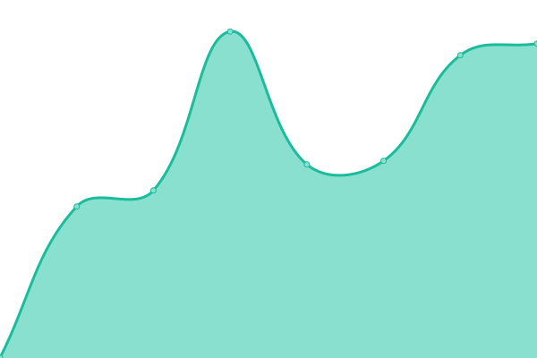
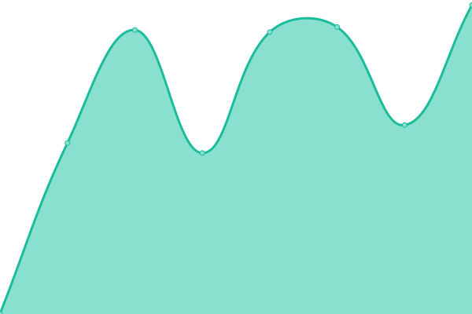

# 📈 Live Status: <!--live status--> **🟥 Complete outage**

<!--start: status pages-->
<!-- This summary is generated by Upptime (https://github.com/upptime/upptime) -->
<!-- Do not edit this manually, your changes will be overwritten -->
<!-- prettier-ignore -->
| URL | Status | History | Response Time | Uptime |
| --- | ------ | ------- | ------------- | ------ |
|  [bit01](https://www.bit01.de) | 🟥 Down | [bit01.yml](https://github.com/bitnulleins/monitoring/commits/HEAD/history/bit01.yml) | 

 589ms
     
 | 

<a href="https://bitnulleins.github.io/monitoring/history/bit01">99.46%</a>
    

|  [bytethinks](https://www.bytethinks.de) | 🟥 Down | [bytethinks.yml](https://github.com/bitnulleins/monitoring/commits/HEAD/history/bytethinks.yml) | 

 198ms
     
 | 

<a href="https://bitnulleins.github.io/monitoring/history/bytethinks">99.46%</a>
    

|  [Keikogi Tool](https://keikogi.bitnulleins.de) | 🟥 Down | [keikogi-tool.yml](https://github.com/bitnulleins/monitoring/commits/HEAD/history/keikogi-tool.yml) | 

 106ms
     
 | 

<a href="https://bitnulleins.github.io/monitoring/history/keikogi-tool">99.46%</a>
    

|  [Bricksfinder](https://bricksfinder.bitnulleins.de) | 🟥 Down | [bricksfinder.yml](https://github.com/bitnulleins/monitoring/commits/HEAD/history/bricksfinder.yml) | 

 111ms
     
 | 

<a href="https://bitnulleins.github.io/monitoring/history/bricksfinder">99.46%</a>
    

|  Handwerker | 🟥 Down | [handwerker.yml](https://github.com/bitnulleins/monitoring/commits/HEAD/history/handwerker.yml) | 

 777ms
     
 | 

<a href="https://bitnulleins.github.io/monitoring/history/handwerker">99.46%</a>
    

|  Spielgruppe | 🟥 Down | [spielgruppe.yml](https://github.com/bitnulleins/monitoring/commits/HEAD/history/spielgruppe.yml) | 

 95ms
     
 | 

<a href="https://bitnulleins.github.io/monitoring/history/spielgruppe">99.46%</a>
    

|  Natur Blog | 🟥 Down | [natur-blog.yml](https://github.com/bitnulleins/monitoring/commits/HEAD/history/natur-blog.yml) | 

 517ms
     
 | 

<a href="https://bitnulleins.github.io/monitoring/history/natur-blog">99.46%</a>
    

|  Karate | 🟥 Down | [karate.yml](https://github.com/bitnulleins/monitoring/commits/HEAD/history/karate.yml) | 

 680ms
     
 | 

<a href="https://bitnulleins.github.io/monitoring/history/karate">99.46%</a>
    

|  Forschungsgruppe | 🟥 Down | [forschungsgruppe.yml](https://github.com/bitnulleins/monitoring/commits/HEAD/history/forschungsgruppe.yml) | 

 529ms
     
 | 

<a href="https://bitnulleins.github.io/monitoring/history/forschungsgruppe">99.46%</a>
    

|  Auge | 🟥 Down | [auge.yml](https://github.com/bitnulleins/monitoring/commits/HEAD/history/auge.yml) | 

 80ms
     
 | 

<a href="https://bitnulleins.github.io/monitoring/history/auge">99.46%</a>
    

|  Zahn | 🟥 Down | [zahn.yml](https://github.com/bitnulleins/monitoring/commits/HEAD/history/zahn.yml) | 

 645ms
     
 | 

<a href="https://bitnulleins.github.io/monitoring/history/zahn">99.46%</a>
    

|  NAS | 🟥 Down | [nas.yml](https://github.com/bitnulleins/monitoring/commits/HEAD/history/nas.yml) | 

 23ms
     
 | 

<a href="https://bitnulleins.github.io/monitoring/history/nas">99.46%</a>
    

|  BACKUP | 🟥 Down | [backup.yml](https://github.com/bitnulleins/monitoring/commits/HEAD/history/backup.yml) | 

 13ms
     
 | 

<a href="https://bitnulleins.github.io/monitoring/history/backup">99.46%</a>
    

<!--end: status pages-->

[**Visit status website →**](https://bitnulleins.github.io/monitoring/)
