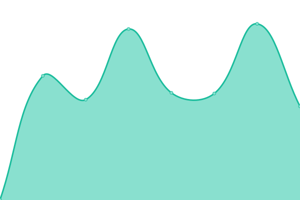

# 📈 Live Status: <!--live status--> **🟧 Partial outage**

<!--start: status pages-->
<!-- This summary is generated by Upptime (https://github.com/upptime/upptime) -->
<!-- Do not edit this manually, your changes will be overwritten -->
<!-- prettier-ignore -->
| URL | Status | History | Response Time | Uptime |
| --- | ------ | ------- | ------------- | ------ |
|  [bit01](https://www.bit01.de) | 🟩 Up | [bit01.yml](https://github.com/bitnulleins/monitoring/commits/HEAD/history/bit01.yml) | 

 1185ms
     
 | 

<a href="https://bitnulleins.github.io/monitoring/history/bit01">99.80%</a>
    

|  [bytethinks](https://www.bytethinks.de) | 🟩 Up | [bytethinks.yml](https://github.com/bitnulleins/monitoring/commits/HEAD/history/bytethinks.yml) | 

 951ms
     
 | 

<a href="https://bitnulleins.github.io/monitoring/history/bytethinks">99.80%</a>
    

|  [Keikogi Tool](https://keikogi.bitnulleins.de) | 🟩 Up | [keikogi-tool.yml](https://github.com/bitnulleins/monitoring/commits/HEAD/history/keikogi-tool.yml) | 

 666ms
     
 | 

<a href="https://bitnulleins.github.io/monitoring/history/keikogi-tool">99.81%</a>
    

|  [Bricksfinder](https://bricksfinder.bitnulleins.de) | 🟩 Up | [bricksfinder.yml](https://github.com/bitnulleins/monitoring/commits/HEAD/history/bricksfinder.yml) | 

 663ms
     
 | 

<a href="https://bitnulleins.github.io/monitoring/history/bricksfinder">99.81%</a>
    

|  Handwerker | 🟩 Up | [handwerker.yml](https://github.com/bitnulleins/monitoring/commits/HEAD/history/handwerker.yml) | 

 1576ms
     
 | 

<a href="https://bitnulleins.github.io/monitoring/history/handwerker">99.63%</a>
    

|  Spielgruppe | 🟩 Up | [spielgruppe.yml](https://github.com/bitnulleins/monitoring/commits/HEAD/history/spielgruppe.yml) | 

 1096ms
     
 | 

<a href="https://bitnulleins.github.io/monitoring/history/spielgruppe">99.82%</a>
    

|  Forschungsgruppe | 🟥 Down | [forschungsgruppe.yml](https://github.com/bitnulleins/monitoring/commits/HEAD/history/forschungsgruppe.yml) | 

 1186ms
     
 | 

<a href="https://bitnulleins.github.io/monitoring/history/forschungsgruppe">98.99%</a>
    

|  Auge | 🟩 Up | [auge.yml](https://github.com/bitnulleins/monitoring/commits/HEAD/history/auge.yml) | 

 1045ms
     
 | 

<a href="https://bitnulleins.github.io/monitoring/history/auge">99.83%</a>
    

|  Zahn | 🟩 Up | [zahn.yml](https://github.com/bitnulleins/monitoring/commits/HEAD/history/zahn.yml) | 

 1598ms
     
 | 

<a href="https://bitnulleins.github.io/monitoring/history/zahn">99.83%</a>
    

|  SYNOLOGY | 🟩 Up | [synology.yml](https://github.com/bitnulleins/monitoring/commits/HEAD/history/synology.yml) | 

 2397ms
     
 | 

<a href="https://bitnulleins.github.io/monitoring/history/synology">99.21%</a>
    

<!--end: status pages-->

[**Visit status website →**](https://bitnulleins.github.io/monitoring/)
